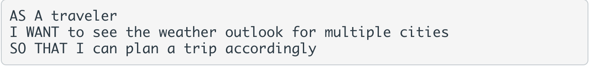

# weather-dashAPI
## Module 6 Create a Weather API 
### to update a current day weather stat as well as load the upcoming 5 days forecast.

## Challenge: 

:link: [View Here](https://gracekevin.github.io/weather-dashAPI/)